# HANGMAN GAME

## Table of contents

1. [UI](#ui)
2. [Features](#features)
3. [Features Left to Implement](#left)
4. [Technology Used](#tech)
5. [Testing](#testing)
6. [Bugs](#bugs)
7. [Deployment](#deployment)
8. [Credits](#credits)
9. [Content](#content)
10. [Acknowledgements](#acknowledgements)

## Project Description

This project is a text-based Hangman game that allows users to guess letters to uncover a hidden word. The game includes multiple topics, each with a list of words, providing a fun and educational experience.

## UI

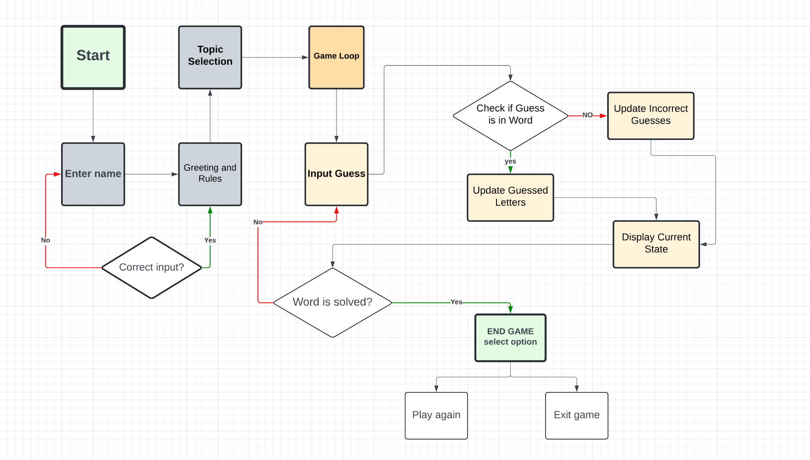

## Features

#### Welcome Screen
The user is greeted with a welcome screen featuring the game's logo. They are prompted to enter their name and confirm their choice.
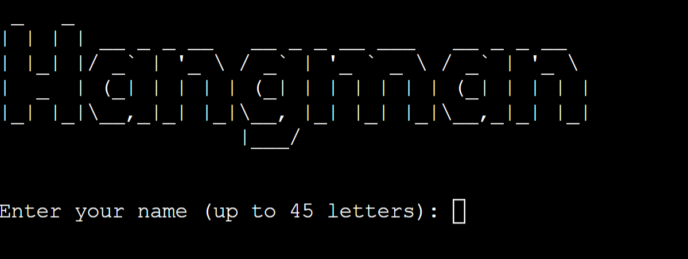

### Validation

#### Player Name Input

The `get_player_name()` function prompts the user to enter their name and ensures the input meets specific criteria:

1. **Length Check**: The function restricts the name to a maximum of 45 characters to prevent excessively long names. If the input exceeds this limit, the user is notified to provide a shorter name.

2. **Character Check**: The function verifies that the input consists solely of alphabetic characters. This ensures that the name contains only letters, preventing invalid entries that include numbers or special characters.

3. **Input Prompt**: If the input fails either validation check, the user is given a clear and informative error message to guide them in providing valid input.

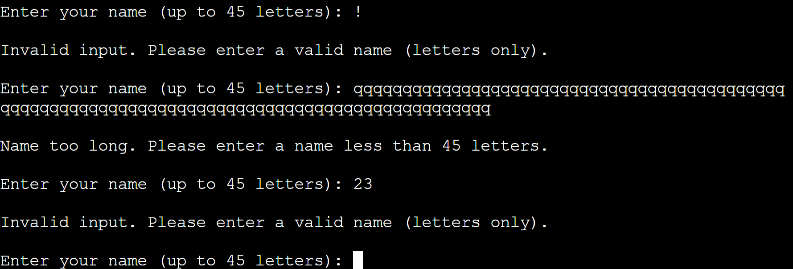

#### Greeting and Rules

1. **Greeting Message**:
   The `print_greeting(player_name)` function delivers a warm welcome to the player by addressing them by name. It provides an overview of the game’s objectives, explaining that the game is a word guessing challenge designed to test vocabulary and spelling skills. This function aims to create an engaging and informative introduction, ensuring the player understands the game's purpose and how to play.

2. **Game Rules**:
   The `print_rules()` function outlines the rules of the game in a clear and structured manner:
   - The player must choose a topic from a list.
   - They will guess the hidden word one letter at a time.
   - The player is allowed up to 6 incorrect guesses.
   - The game ends with a win if all letters are guessed correctly within the allowed attempts.
   - The game ends with a loss if the number of incorrect guesses exceeds 6.
   - Letter guessing is case-insensitive, meaning 'A' and 'a' are considered the same.

   This section ensures that players are well-informed about the game mechanics before they start playing.

3. **Topic Selection**:
   The `choose_topic(topics)` function allows the player to select a topic from a list. It handles both numeric and textual inputs:
   - The function displays a list of available topics with corresponding numbers.
   - The player can choose a topic by entering the number or name.

   This ensures a smooth and user-friendly topic selection process, contributing to an overall enjoyable gaming experience.

   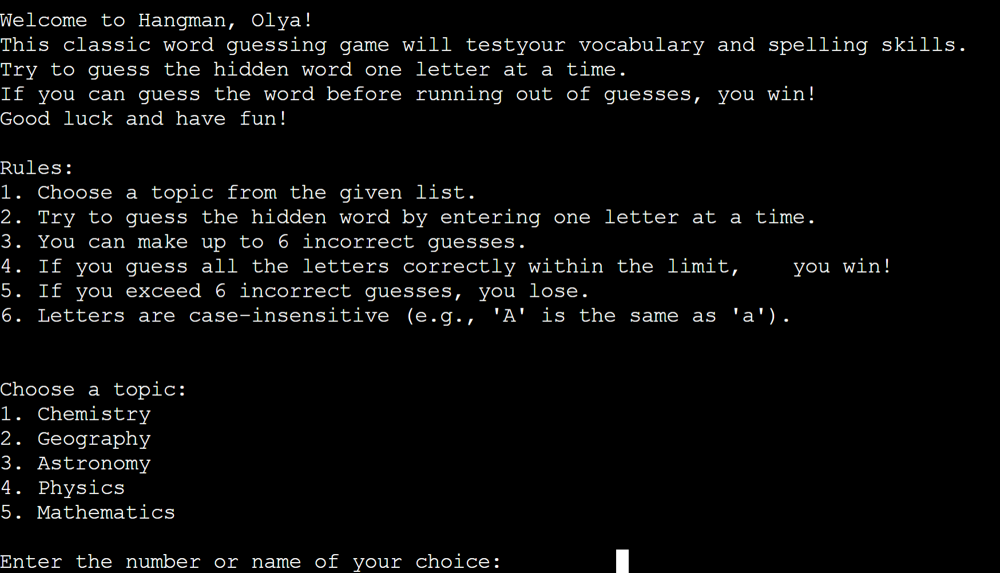

    - The function validates the input and selects a random word from the chosen topic.
    - It provides feedback if the input is invalid, prompting the player to make a correct selection.

    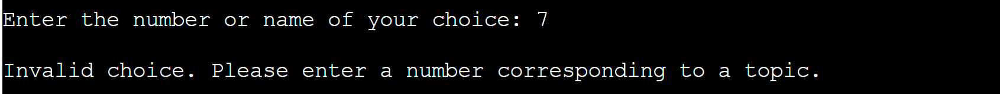

#### Game Play

1. **Display Initial State**:
   Once a valid topic is selected and a word is chosen, the initial state of the game is displayed:
   - The `print_hangman(0)` function is called to show the initial hangman state with no incorrect guesses.
   - The `display_current_state(word, guessed_letters)` function displays the word to guess with underscores representing each letter. As no letters have been guessed yet, all characters are shown as underscores.

   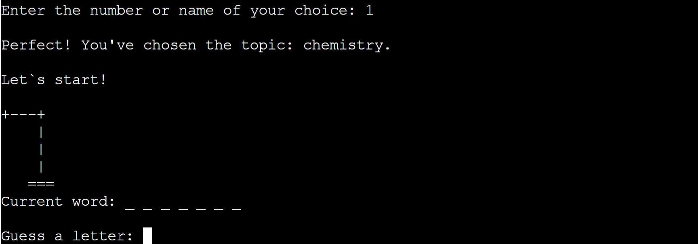

2. **Handling Guesses**:
   The game enters an infinite loop where the player makes guesses until they either win or lose:
   - The `handle_guess(word, guessed_letters, incorrect_guesses)` function prompts the player to guess a letter. This function validates the input to ensure it is a single alphabetic character and checks if the letter has already been guessed.
   - If the guess is correct, the letter is added to `guessed_letters`. If incorrect, it is added to `incorrect_guesses`, and the hangman state is updated accordingly.

  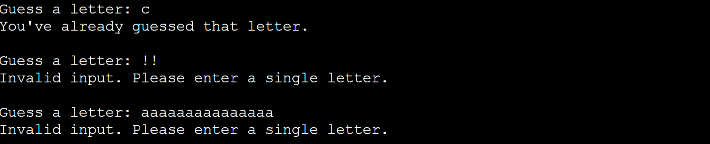 

3. **Updating and Displaying State**:
   After each guess, the following updates occur:
   - The `display_current_state(word, guessed_letters)` function updates the display to show correctly guessed letters in their positions while keeping underscores for the remaining hidden letters.
   - If there are incorrect guesses, these are displayed to keep the player informed.

   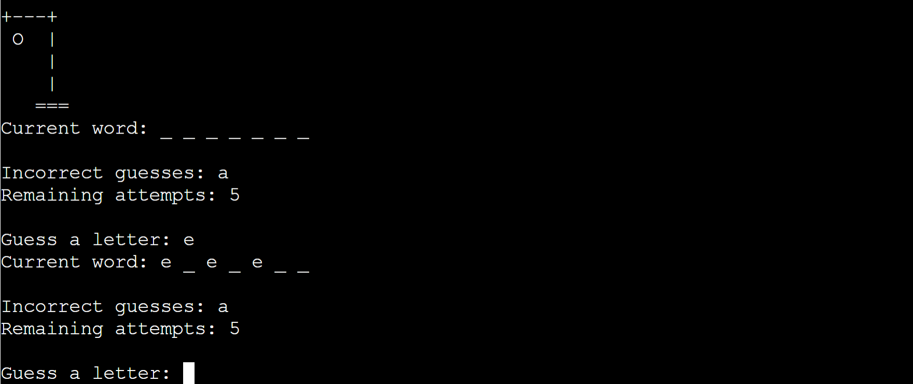

4. **Checking Win/Loss Conditions**:
   The game checks if the player has won or lost:
   - The `check_win(word, guessed_letters)` function checks if all letters in the word have been guessed correctly. If so, the player wins, and a congratulatory message is displayed using `print_you_win()`.

   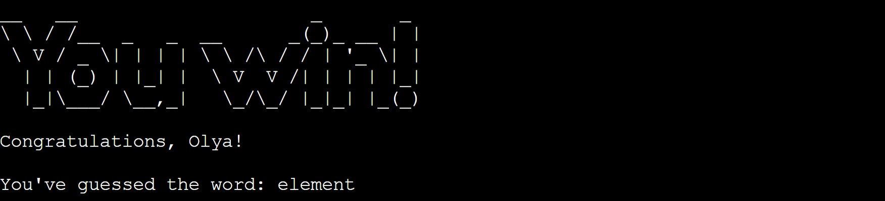

   - The `check_loss(incorrect_guesses, max_incorrect)` function checks if the player has exceeded the maximum allowed incorrect guesses. If so, the game ends with a loss, and the game over message is displayed using `print_game_over()`.

   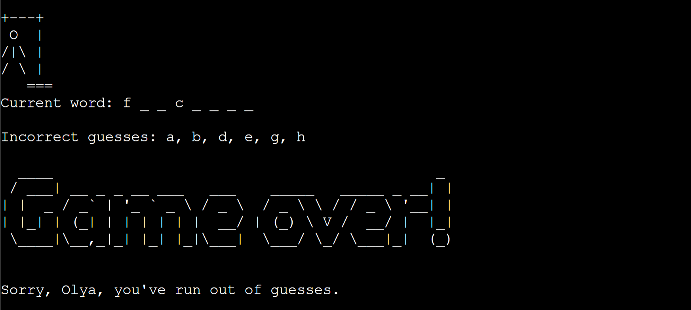

5. **Remaining Attempts**:
   The number of remaining attempts is displayed to keep the player informed about how many guesses they have left.

   

6. **Play Again Prompt**:
   After the game concludes, whether by win or loss, the player is prompted to decide if they want to play again:
   - The program asks the player, "Do you want to play again? (yes/no):".
   - The input is validated to ensure it is either 'yes', 'y', 'no', or 'n'.
   - If the player chooses 'yes' or 'y', the game restarts from the beginning, allowing the player to select a new topic and start a new game.
   - If the player chooses 'no' or 'n', a farewell message is displayed, thanking the player for playing, and the game exits.

   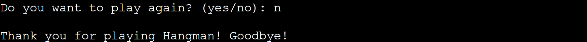

## Features Left to Implement

1. **Hint System**:
   - Add a hint system that provides players with a clue about the word if they are struggling. This could be limited to a certain number of hints per game to maintain the challenge.

2. **Difficulty Levels**:
   - Introduce different difficulty levels (e.g., easy, medium, hard) that affect the length and complexity of the words chosen, as well as the number of incorrect guesses allowed.

3. **Score Tracking**:
   - Implement a scoring system to track players' performance across multiple games. This could include tracking the number of wins and losses, as well as a points system based on the number of correct guesses and remaining attempts.

4. **Leaderboard**
   - Create a leaderboard to display the top players based on their scores. This could be a local leaderboard or an online one to allow players to compete globally.

